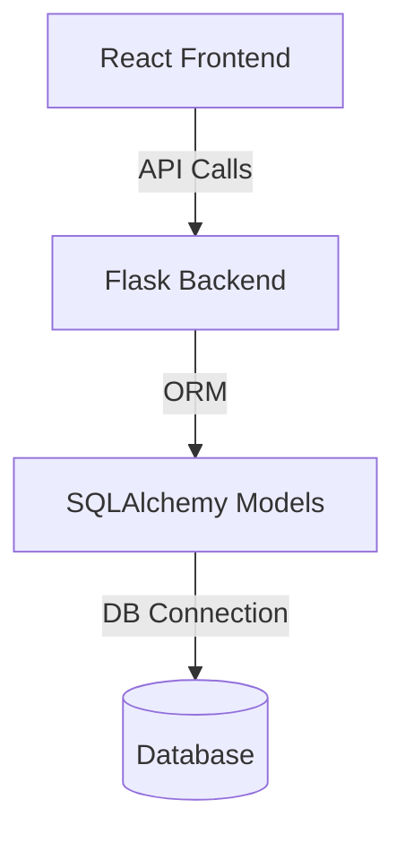

# Order Management System

## Overview
This project is a full-stack Order Management System designed for managing users and orders in a trading environment. It is organized into a clear separation of backend and frontend layers, following modern web application architecture.

---

## Application Structure

**Layers:**
- **Backend (Flask/Python):** Handles API endpoints, business logic, and database operations.
- **Frontend (React/JS):** Provides a user-friendly interface for interacting with orders and users.
- **Database:** Stores persistent data for users and orders, supports MySQL, SQLite, and PostgreSQL.

**Design:**
- **Backend:**
  - `backend/app.py`: Main Flask application, routing, and API endpoints.
  - `backend/models.py`: SQLAlchemy models for Users and Orders.
  - `backend/database.py`: Database connection and setup.
  - `backend/extensions.py`: Flask extensions (e.g., CORS, SQLAlchemy).
  - `backend/instance/orders.db`: SQLite database file (default for local development).
- **Frontend:**
  - `frontend/src/App.jsx`: Main React component, manages views and state.
  - `frontend/src/components/OrderForm.jsx`, `OrderList.jsx`, `OrderSearch.jsx`: Order management UI.
  - `frontend/src/components/UserForm.jsx`, `UserList.jsx`: User management UI.
  - `frontend/src/api.js`: Handles API requests to the backend.
  - `frontend/public/`, `frontend/src/assets/`: Static assets and images.

---

## Technologies Used

- **Backend:**
  - Flask (Python web framework)
  - SQLAlchemy (ORM for database access)
  - Databases: MySQL, SQLite, PostgreSQL (configurable)
- **Frontend:**
  - React (JavaScript UI library)
  - Vite (React build tool)
  - CSS for styling
- **Other:**
  - RESTful API design
  - CORS for cross-origin requests

---

## Data Flow & Architecture

- **Frontend** sends requests to the **Backend** via REST API.
- **Backend** processes requests, interacts with the **Database** using SQLAlchemy.
- **Database** stores users and orders.

---

## Screenshots

---

## How to Run

1. **Backend:**
   - Install Python dependencies: `pip install -r requirements.txt`
   - Run Flask app: `python backend/app.py`
2. **Frontend:**
   - Install Node dependencies: `npm install` (in `frontend` folder)
   - Start React app: `npm run dev`
3. **Access:**
   - Frontend: `http://localhost:5173`
   - Backend API: `http://localhost:5000`

---

## Features
- Create, edit, delete users
- Create, search, view orders
- Responsive UI
- Persistent storage with SQL databases

---

## Extensibility
- Easily switch database engines (MySQL, SQLite, PostgreSQL)
- Add new features by extending React components and Flask routes

---

## License
See `LICENSE` for details.